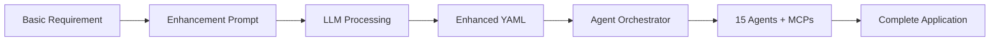

# Requirement Enhancement System for Agent Swarm

## Overview

This directory contains a comprehensive prompt system for transforming basic project requirements into detailed specifications optimized for the 15-agent autonomous development swarm.

## 🎯 Purpose

When building complex applications with the agent swarm, the quality of the initial requirement document directly impacts:
- Agent selection and orchestration patterns
- MCP server activation
- Workflow optimization
- Final deliverable quality

This requirement enhancement system ensures that even basic project descriptions are transformed into comprehensive specifications that maximize the swarm's effectiveness.

## 📁 Files in This Directory

| File | Purpose |
|------|---------|
| `requirement_enhancer_prompt.md` | Main prompt template for requirement enhancement |
| `REQUIREMENT_ENHANCER_QUICKREF.md` | Quick reference guide with trigger words and patterns |
| `example_requirement_transformation.md` | Complete example showing before/after transformation |
| `use_requirement_enhancer.py` | Python script demonstrating usage |
| `README.md` | This documentation file |

## 🚀 Quick Start

### Step 1: Prepare Your Basic Requirement
Write a paragraph describing your project idea. Example:
```
I need a task management app with AI that helps prioritize tasks based on 
deadlines and importance. Users should be able to collaborate on projects.
```

### Step 2: Use the Enhancement Prompt
1. Copy the content from `requirement_enhancer_prompt.md`
2. Add your basic requirement at the bottom
3. Submit to any LLM (Claude, GPT-4, Gemini, etc.)

### Step 3: Save Enhanced Output
Save the generated YAML output as `requirements.yaml`

### Step 4: Run the Agent Swarm
```bash
python orchestrate_enhanced.py --requirements requirements.yaml
```

## 🎨 How It Works

### Input → Enhancement → Orchestration



### Key Transformations

1. **Vague Features** → Specific requirements with acceptance criteria
2. **Missing Technical Details** → Complete tech stack specifications
3. **Implicit Needs** → Explicit technical requirements
4. **Simple Descriptions** → Detailed data models and relationships
5. **Basic Goals** → Measurable success metrics

## 🔑 Optimization Triggers

The enhancement prompt is designed to recognize keywords that trigger specific workflows and MCP activations:

### Payment Keywords
- **Triggers**: payment, billing, subscription, e-commerce
- **Activates**: Stripe MCP, payment_enabled_webapp workflow
- **Agents**: api-integrator, devops-engineer

### AI/ML Keywords
- **Triggers**: AI, ML, GPT, recommendations, categorization
- **Activates**: ai-specialist agent, OpenAI integration
- **Result**: Intelligent features with caching and fallbacks

### Real-time Keywords
- **Triggers**: real-time, live, instant, chat, notifications
- **Activates**: WebSocket implementation
- **Result**: Socket.io integration, event-driven architecture

### Performance Keywords
- **Triggers**: high-performance, scale, concurrent, load
- **Activates**: performance-optimizer early in workflow
- **Result**: Caching strategies, CDN setup, load balancing

## 📊 Output Structure

The enhanced requirement follows this structure:

```yaml
project:
  name: "Descriptive Name"
  type: "web_app|api_service|ai_solution"
  complexity: "simple|moderate|complex"

core_requirements:
  - id: "REQ-001"
    description: "What must be built"
    acceptance_criteria: ["Measurable criteria"]

technical_requirements:
  - id: "TECH-001"
    description: "Infrastructure needs"

features:
  - name: "Feature Name"
    components: ["Sub-components"]

tech_stack:
  frontend: {framework: "React"}
  backend: {framework: "FastAPI"}
  database: {primary: "PostgreSQL"}

integrations:
  - service: "Service Name"
    purpose: "Why needed"

success_metrics:
  performance: ["<200ms response"]
  business: ["100 users/day"]
```

## 🎯 Best Practices

### DO:
- ✅ Include specific performance requirements
- ✅ Mention compliance needs (GDPR, HIPAA)
- ✅ Specify if mobile-first is important
- ✅ Include data relationships
- ✅ Mention third-party integrations
- ✅ Set realistic timelines

### DON'T:
- ❌ Override tech stack unless necessary
- ❌ Over-complicate simple projects
- ❌ Forget security requirements
- ❌ Skip success metrics
- ❌ Ignore scalability needs

## 📈 Complexity Guidelines

### Simple Projects (1 week)
- 3-5 core requirements
- Basic CRUD operations
- Standard authentication
- 1-2 integrations

### Moderate Projects (2-3 weeks)
- 5-10 core requirements
- Multiple user roles
- Real-time features
- 3-5 integrations

### Complex Projects (1+ month)
- 10+ core requirements
- Microservices architecture
- ML/AI components
- High scalability needs

## 🔧 Integration with Agent Swarm

The enhanced requirements automatically:

1. **Select Optimal Agents**: Based on project type and features
2. **Activate MCPs**: Keywords trigger relevant MCP servers
3. **Define Workflows**: Patterns determine execution order
4. **Set Priorities**: Critical requirements execute first
5. **Enable Parallelism**: Independent tasks run simultaneously

## 📝 Example Transformation

See `example_requirement_transformation.md` for a complete before/after example showing how a basic freelance marketplace idea becomes a comprehensive 200+ line requirement specification.

## 🚦 Validation Checklist

Before using the enhanced requirement, verify:
- [ ] All original features are captured
- [ ] Tech choices respect explicit preferences
- [ ] Requirements have IDs and acceptance criteria
- [ ] Data models are defined
- [ ] Success metrics are measurable
- [ ] Security needs are addressed
- [ ] Integrations are specified

## 🔍 Testing Your Enhancement

### Mock Mode Test
```bash
set MOCK_MODE=true  # Windows
export MOCK_MODE=true  # Linux/Mac

python orchestrate_enhanced.py --requirements requirements.yaml --mock
```

### Real Execution
```bash
python orchestrate_enhanced.py --requirements requirements.yaml --dashboard
```

## 💡 Pro Tips

1. **Mention "payment"** to ensure Stripe integration
2. **Include "real-time"** for WebSocket priority
3. **Specify "mobile-first"** for responsive design
4. **Add "offline-capable"** for PWA features
5. **Include performance targets** for optimization
6. **Mention compliance** for security focus

## 📚 Additional Resources

- [Agent Swarm Documentation](../ultimate_agent_plan.md)
- [Development Standards](../CLAUDE.md)
- [MCP Integration Guide](../docs/MCP_INTEGRATION_GUIDE.md)
- [Test Framework](../docs/TEST_STATUS.md)

## 🤝 Contributing

To improve the requirement enhancement system:
1. Test with various project types
2. Document edge cases
3. Add new trigger patterns
4. Update optimization rules

## 📞 Support

For issues or questions:
- Review examples in this directory
- Check the quick reference guide
- Consult the main project documentation
- Test with mock mode first

---

*Last Updated: August 31, 2025*
*Version: 1.0.0*
*Compatible with: Agent Swarm v100 (Complete)*